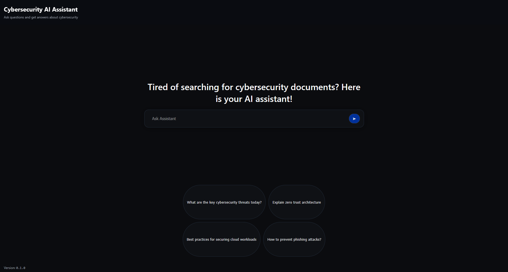
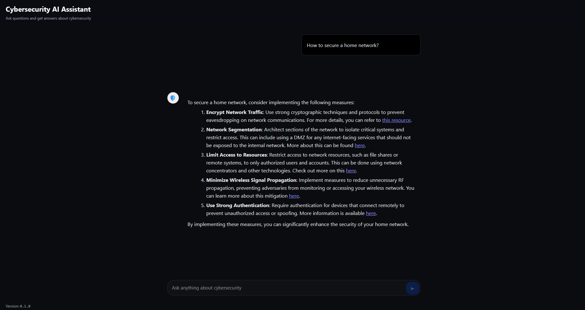

# Utilizing Azure OpenAI for Intelligent Question Answering (Specialized for Cybersecurity)




This repo contains a Gemini‑inspired React frontend and a FastAPI backend that uses Azure OpenAI + Azure AI Search to answer cybersecurity questions grounded in your documents.

## Overview

- Frontend: Vite + React, Markdown rendering (`react-markdown` + `remark-gfm`) with syntax highlighting (`rehype-highlight`).
- Backend: FastAPI endpoint `/api/chat` performing retrieval (Azure AI Search) + generation (Azure OpenAI).
- Data: Files in `backend/docs/` are converted to JSON, uploaded to Azure Blob Storage, and indexed into Azure AI Search.

## Prerequisites

- Azure subscription with rights to create Cognitive Services (Azure OpenAI), Search, and Storage.
- Authentication via `DefaultAzureCredential`:
	- Option A: `az login` (Interactive browser/device login).
	- Option B: Service Principal env vars: `AZURE_CLIENT_ID`, `AZURE_TENANT_ID`, `AZURE_CLIENT_SECRET`.
- Node.js 18+ and Python 3.10+.

## Configure Backend

Edit `backend/_config.py` to set resource names and region:

- Resource Groups: `RG_NAME`, `STORAGE_RG_NAME`, `LOCATION`
- OpenAI: `OPENAI_NAME`, `EMBEDDING_MODEL_NAME`, `EMBEDDING_DEPLOYMENT_NAME`, `GPT_MODEL_NAME`, `GPT_DEPLOYMENT_NAME`
- Search: `SEARCH_NAME`, `INDEX_NAME`
- Storage: `STORAGE_NAME` (globally unique), `CONTAINER_NAME`

## Quick Start

1) Provision Azure resources

```bash
cd backend
# Create and activate a local virtual env
python -m venv .venv
.\.venv\Scripts\Activate.ps1   # PowerShell on Windows
```
or
```bash
source .venv/bin/activate   # macOS/Linux
```
```bash
# Install backend dependencies into .venv
pip install -r requirements.txt
# Provision Azure resources
python deploy.py
```

2) Upload and index documents

Place source files under `backend/docs/` (supports `.txt`, `.pdf`, `.docx`). Then:

```bash
python upload_doc.py   # runs inside .venv after activation
```

3) Start the backend API (FastAPI)

```bash
python -m uvicorn server:app --host 0.0.0.0 --port 8000 --reload
# (running inside .venv; keep the shell open while developing)
```

4) Configure and run the frontend

```bash
cd frontend
copy .env.example .env   # Windows (or: cp .env.example .env)
# In .env set: VITE_API_BASE_URL=http://localhost:8000
npm install
npm run dev
```

Open http://localhost:5173

## API Contract

- Endpoint: `POST {VITE_API_BASE_URL}/api/chat`
- Request:

```json
{ "question": "Your message" }
```

- Response:

```json
{ "answer": "Assistant reply" }
```

Plain‑text responses are displayed directly.

## Project Structure

- Frontend
	- `frontend/index.html`, `frontend/src/main.jsx` — entry
	- `frontend/src/components/Chat.jsx` — chat UI (hero prompt bar, chips)
	- `frontend/src/components/Message.jsx` — Markdown + syntax highlighting
	- `frontend/src/api/client.js` — backend calls
	- `frontend/src/styles.css` — dark theme styling
- Backend
	- `backend/server.py` — FastAPI server exposing `/api/chat`
	- `backend/_config.py`, `backend/_credentials.py`, `backend/_utils.py` — configuration, credentials, helpers
	- `backend/deploy.py` — creates resources and model deployments
	- `backend/upload_doc.py` — converts docs to JSON, uploads to blob, indexes Search
	- `backend/search_and_answer.py` — sample pipeline test
	- `backend/azure_setup/` — resource creation helpers

## Troubleshooting

- Auth errors: ensure `az login` succeeded or SP env vars are set.
- Permissions: identity must have Contributor or the appropriate roles on RGs and services.
- OpenAI credentials: verify `OPENAI_NAME` + `RG_NAME` and that keys/endpoints resolve in `_utils.get_azure_openai_credentials()`.
- Search admin key: confirm `SEARCH_NAME` exists in `RG_NAME`, and names match `_config.py`.
- Frontend 404/CORS: set `VITE_API_BASE_URL` correctly; backend must run on `http://localhost:8000`.

## Notes

- The frontend `package.json` already includes `react-markdown`, `remark-gfm`, and `rehype-highlight`; `npm install` installs all required packages.
